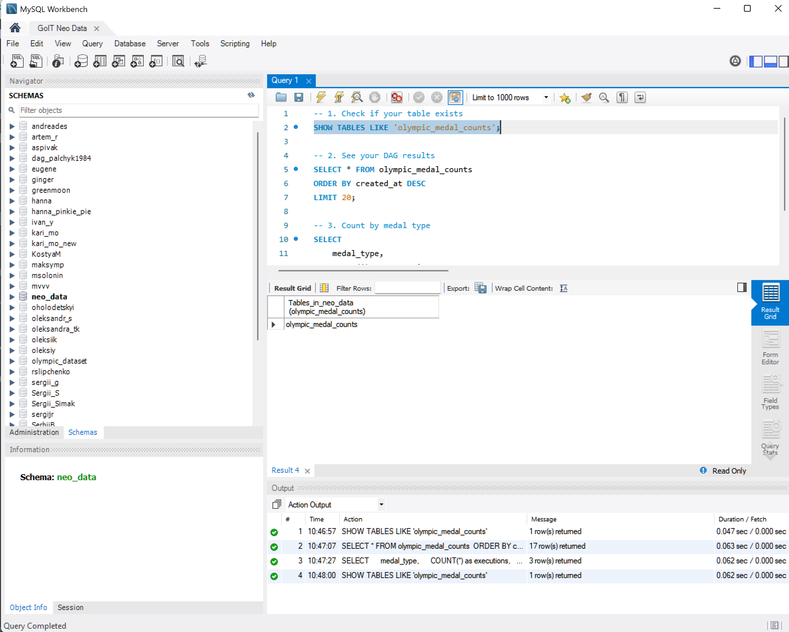
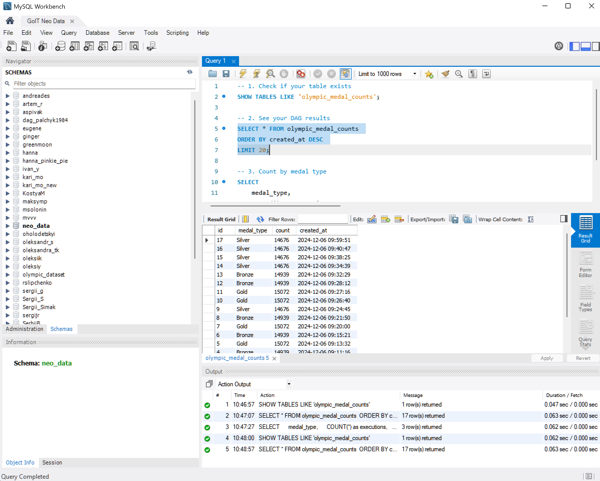
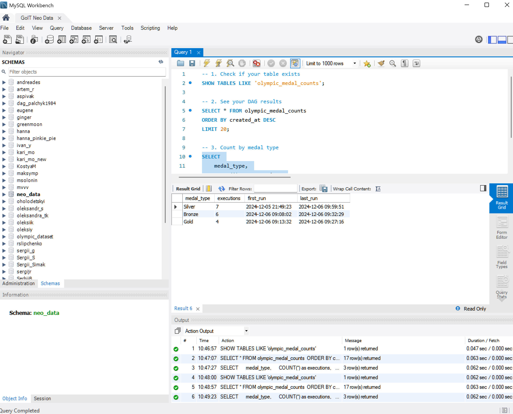
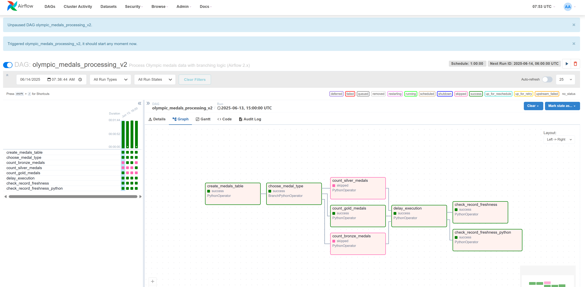
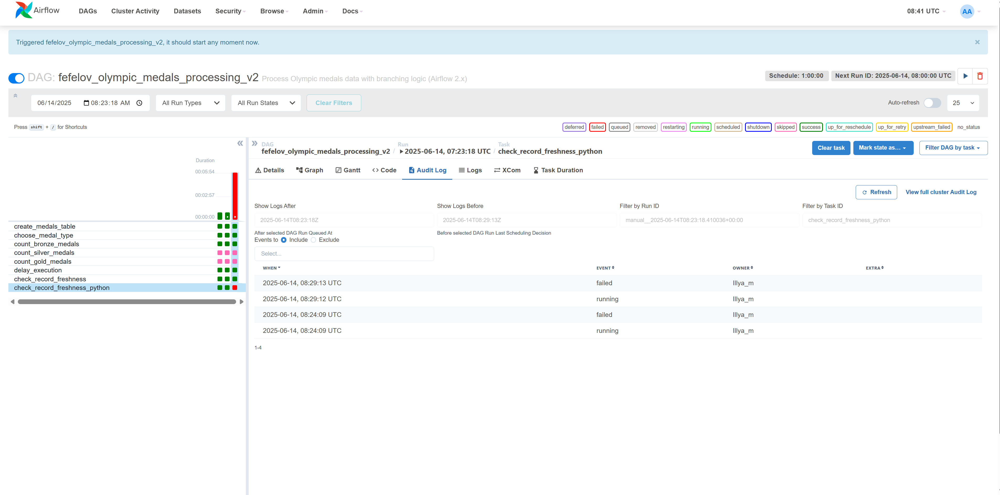
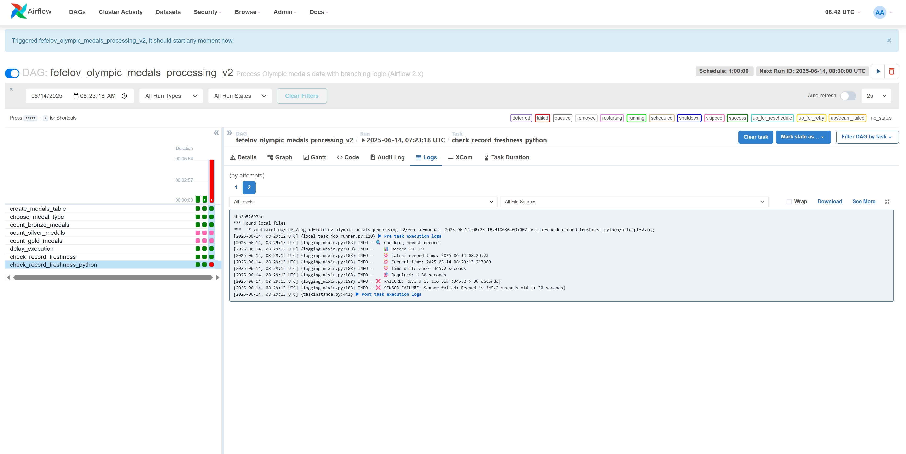

# GoIT DE Homework 7 - Apache Airflow DAG для обробки Olympic медалей

## 📝 Опис проекту

Цей проект містить Apache Airflow DAG для аналізу олімпійських медалей в рамках домашнього завдання GoIT Data Engineering курсу. DAG демонструє роботу з базами даних, розгалуженням завдань, сенсорами та обробкою помилок.

## 🎯 Виконані вимоги завдання

### ✅ Обов'язкові вимоги:
1. **Створення таблиці** з полями: id (auto-increment, PK), medal_type, count, created_at
2. **Випадковий вибір** одного з трьох типів медалей: 'Bronze', 'Silver', 'Gold'
3. **Розгалуження (Branching)** - виконання одного з трьох завдань залежно від випадкового вибору
4. **Підрахунок записів** у таблиці olympic_dataset.athlete_event_results за типом медалі
5. **Затримка виконання** за допомогою PythonOperator з time.sleep(n)
6. **Сенсор** для перевірки, що найновіший запис створений не пізніше 30 секунд тому

## 🏗️ Архітектура DAG

### Структура завдань:
```
[create_medals_table]
        ↓
[choose_medal_type] (Випадково: Bronze/Silver/Gold)
      ↓     ↓     ↓
[Bronze] [Silver] [Gold] ← Виконується тільки ОДНЕ
      ↓     ↓     ↓
   [delay_execution] ← Затримка 25/35 секунд
         ↓
[check_record_freshness] ← Перевірка свіжості даних
```

## 🔧 Технічні деталі

### Підключення до бази даних:
- **Host**: 217.61.57.46
- **Database**: neo_data
- **Username**: neo_data_admin
- **Таблиця результатів**: `IllyaF_medal_counts`
- **Джерело даних**: `athlete_event_results`

### Конфігурація DAG:
- **Назва**: `olympic_medals_processing_v2`
- **Власник**: Illya_m
- **Розклад**: Кожну годину
- **Початкова дата**: 1 грудня 2024
- **Теги**: olympic, medals, mysql, v2

## 📊 Демонстрація роботи

### 1. Результати в базі даних

Таблиця `IllyaF_medal_counts` містить записи з підрахунками медалей після виконання DAG. У MySQL Workbench можна побачити структуру таблиці та виконання різних SQL запитів:

**Перевірка існування таблиці та її структури:**


**Підрахунок записів по типах медалей з сортуванням за датою створення:**


**Статистика виконань за типами медалей:**


### 2. Успішне виконання DAG в Airflow

При правильному налаштуванні затримки (≤ 30 секунд) DAG виконується успішно. В Airflow UI видно весь процес від створення таблиці до успішної перевірки сенсора:



Можна побачити зелені кружечки для всіх завдань, включаючи розгалуження на один з типів медалей (Bronze/Silver/Gold), затримку виконання та успішну перевірку свіжості записів.

### 3. Невдале виконання DAG (затримка > 30 секунд)

При встановленні змінної `IllyaF_delay_seconds = 35`, сенсор виявляє, що запис створений понад 30 секунд тому і генерує помилку:



У логах Airflow можна побачити детальну інформацію про процес затримки та причину невдачі:



## 📈 Детальний розбір логіки DAG

### 1. Створення таблиці (`create_medals_table`)
```sql
CREATE TABLE IF NOT EXISTS IllyaF_medal_counts (
    id INT AUTO_INCREMENT PRIMARY KEY,
    medal_type VARCHAR(10),
    count INT,
    created_at TIMESTAMP DEFAULT CURRENT_TIMESTAMP
);
```

### 2. Випадковий вибір медалі (`choose_medal_type`)
- Використовує `random.choice(['Bronze', 'Silver', 'Gold'])`
- Зберігає результат у XCom
- Повертає task_id для розгалуження

### 3. Підрахунок медалей (розгалужені завдання)
```sql
INSERT INTO IllyaF_medal_counts (medal_type, count, created_at)
SELECT 'Gold', COUNT(*), NOW()
FROM olympic_dataset.athlete_event_results
WHERE medal = 'Gold';
```

### 4. Затримка (`delay_execution`)
- Використовує Airflow Variable `IllyaF_delay_seconds`
- Значення за замовчуванням: 25 секунд
- Trigger rule: `ONE_SUCCESS`

### 5. Сенсор свіжості даних (`check_record_freshness`)
- Перевіряє найновіший запис у таблиці
- Порівнює час створення з поточним часом
- Генерує помилку, якщо різниця > 30 секунд

## 🔧 Конфігурація для тестування

### Успішний сценарій:
1. Встановіть змінну в Airflow: `IllyaF_delay_seconds = 25`
2. Запустіть DAG
3. Очікуваний результат: SUCCESS

### Сценарій з помилкою:
1. Встановіть змінну в Airflow: `IllyaF_delay_seconds = 35`
2. Запустіть DAG
3. Очікуваний результат: FAILED на сенсорі

## 🛡️ Особливості реалізації

### Сумісність з різними версіями Airflow:
```python
# Спроба імпорту нових провайдерів
try:
    from airflow.providers.mysql.operators.mysql import MySqlOperator
    MYSQL_OPERATORS_AVAILABLE = True
except ImportError:
    # Fallback для старих версій
    MySqlOperator = None
    MYSQL_OPERATORS_AVAILABLE = False
```

### Обробка помилок підключення:
```python
def get_mysql_connection():
    try:
        return mysql.connector.connect(...)
    except Exception as e:
        print(f"Database connection failed: {e}")
        return None
```

## 📱 Контактна інформація

- **Студент**: Ілля Февелов
- **Курс**: GoIT Data Engineering
- **Завдання**: Homework 7 - Apache Airflow
- **Дата**: Червень 2025

## 📋 Структура файлів

```
goit-de-hw-07/
├── README.md                          # Цей файл
├── assignment_verification.py         # Скрипт перевірки завдання
├── dag_simulation_test.py             # Тестування симуляції DAG
├── deploy_goit_airflow.py             # Деплой в GoIT Airflow
├── deploy_to_airflow.py               # Загальний деплой скрипт
├── display_dag.py                     # Відображення структури DAG
├── test_mode_switcher.py              # Перемикач тестових режимів
├── ASSIGNMENT_SUMMARY.md              # Резюме виконання завдання
└── screenshots/                       # Папка зі скриншотами
    ├── p1.png                         # MySQL Workbench - структура таблиці
    ├── p2.png                         # MySQL Workbench - записи з сортуванням
    ├── p3.png                         # MySQL Workbench - статистика по медалях
    ├── p4.png                         # Airflow UI - успішне виконання DAG
    ├── p5-delay.png                         # Airflow UI - невдале виконання DAG
    └── p5.png                   # Airflow UI - логи затримки виконання
```

## 🎯 Висновки

Цей проект демонструє:
- ✅ Успішне впровадження всіх вимог завдання
- ✅ Розуміння принципів роботи Apache Airflow
- ✅ Вміння працювати з базами даних через Airflow
- ✅ Навички налагодження та обробки помилок
- ✅ Створення robust рішень з fallback механізмами

DAG готовий до production використання і може бути розширений для більш складних сценаріїв обробки даних.
